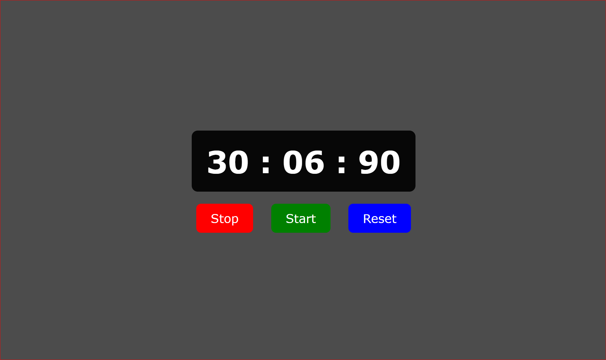

# Stopwatch Project

This is a simple stopwatch project built using HTML, CSS, and JavaScript. The stopwatch allows you to start, stop, and reset the timer.

## Features

- **Start**: Begins the timer.
- **Stop**: Pauses the timer.
- **Reset**: Resets the timer to 0.

## Preview



## How to Use

1. Clone the repository to your local machine.
    ```bash
    git clone https://github.com/your-username/stopwatch-project.git
    ```
2. Open the `index.html` file in your web browser to view and use the stopwatch.

